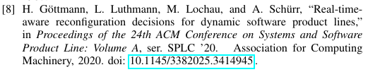

# IEEEtran.bst BibTeX Style including DOIs

This *modified* IEEEtran.bst BibTeX style ([IEEEtranDOI.bst](./IEEEtranDOI.bst)) includes DOIs (Digital Object Identifiers) into the references.

Example entry taken from an output PDF:

An example project ([conference.tex](./conference.tex) and [references.bib](./references.bib)) is included in this repo.

## License

This project is licensed unter the [LaTeX Project Public License](./LICENSE).
